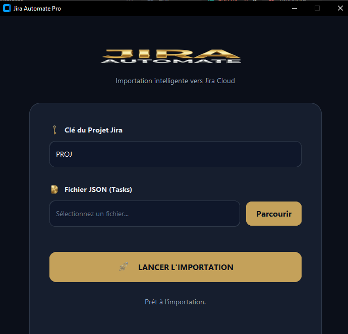

# 🚀 Jira Automate Pro

[](https://www.python.org/)
[]()



## 🌟 Présentation
**Jira Automate Pro** est un outil d'importation intelligent conçu pour automatiser la création de tâches sur **Jira Cloud**. Avec une interface sombre et moderne aux accents dorés, cet outil permet de transformer vos fichiers de planification JSON en tickets Jira de manière fluide et efficace.

## ✨ Fonctionnalités
- 🎨 **Interface Premium** : Design dark/gold avec effets de verre pour une expérience utilisateur haut de gamme.
- 🔑 **Gestion Simplifiée** : Saisie rapide de la clé de projet et sélection intuitive du fichier JSON.
- 🚀 **Automatisation Complète** : Créez des dizaines de tickets Jira en un seul clic.
- ⚙️ **Gestion des Erreurs** : Retours en temps réel sur le statut de l'importation.

## 🛠️ Installation

1. **Cloner le projet** :
   ```bash
   git clone https://github.com/charaf12-u/automate-jira.git
   cd automate-jira
   ```

2. **Installer les dépendances** :
   ```bash
   pip install -r requirements.txt
   ```

3. **Configuration** :
   Renommez ou modifiez le fichier `.env` et ajoutez vos accès Jira :
   - `JIRA_DOMAIN` : Votre domaine Jira (ex: mycompany.atlassian.net)
   - `JIRA_EMAIL` : Votre email Atlassian
   - `JIRA_API_TOKEN` : Votre jeton d'API Jira
   - `JIRA_PROJECT_KEY` : Clé par défaut du projet (optionnel)

## 🚀 Utilisation

1. **Lancez l'application** :
   ```bash
   python app.py
   ```

2. **Entrez la Clé du Projet** : Saisissez l'identifiant de votre projet Jira (ex: PROJ).
3. **Sélectionnez le fichier JSON** : Cliquez sur "Parcourir" pour choisir votre fichier contenant les tâches.
4. **Lancez l'importation** : Cliquez sur le bouton fusée 🚀 pour démarrer le processus.

## 📄 Format du fichier JSON
Le fichier JSON doit avoir la structure suivante :
```json
[
  {
    "summary": "Titre de la tâche",
    "description": "Description détaillée de l'issue",
    "issuetype": "Task"
  }
]
```

---
Dépendance : `customtkinter`, `requests`, `pillow`, `python-dotenv`.
